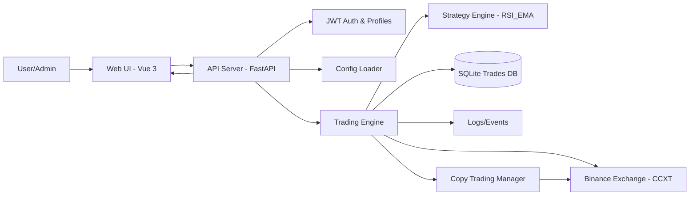
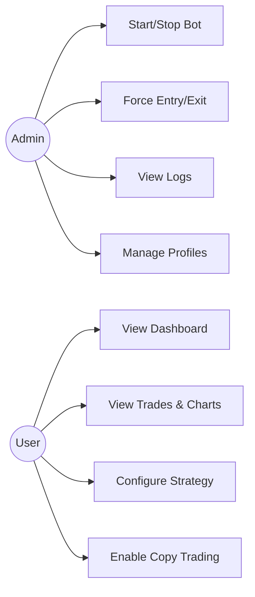
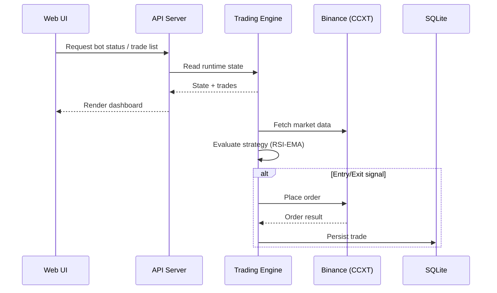
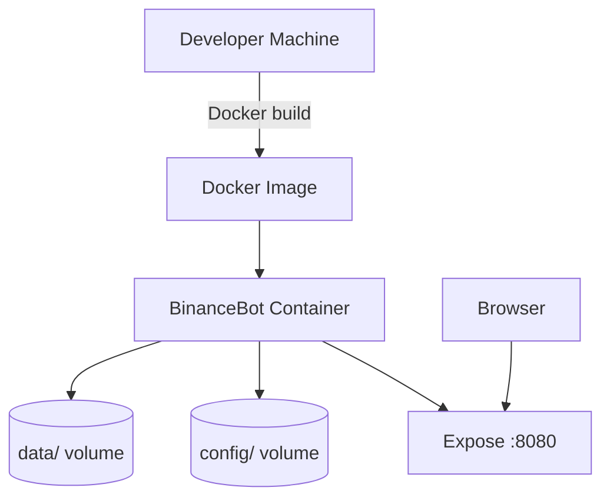

# Project Title

BinanceBot - Ứng dụng giao dịch tự động cho Binance với giao diện quản trị web

Course Project: Software Engineering (SE2025-9.4)

## Project Information

| Item | Detail |
| --- | --- |
| Course | Software Engineering |
| Team Size | 4 members |
| Scope | Auto-trading (Spot) + Web UI |
| Platform | Binance API (via CCXT) |

## Table of Contents

1. Introduction  
2. Goals  
3. Objectives  
4. System Overview  
5. System Architecture  
6. Technology Stack  
7. Installation  
8. Project Structure  
9. Usage  
10. Backtest Results  
11. Limitations and Future Work  
12. Conclusion  


## 1. Introduction

Dự án xây dựng một hệ thống giao dịch tự động cho sàn Binance, kết hợp bot giao dịch
và giao diện web quản trị. Hệ thống giúp người dùng theo dõi trạng thái bot, quản lý
chiến lược, xem lịch sử giao dịch, và điều khiển vận hành theo cơ chế phân quyền.
Đây là dự án kết thúc học phần, nhấn mạnh tư duy kiến trúc và khả năng triển khai thực tế.

## 2. Goals

- Xây dựng một hệ thống auto-trading end-to-end cho Binance Spot, có khả năng chạy thực tế và dễ demo.
- Cung cấp giao diện web quản trị trực quan để theo dõi trạng thái bot, hiệu suất, lịch sử giao dịch và cấu hình.
- Đảm bảo vận hành an toàn: phân quyền rõ ràng, hạn chế thao tác nhạy cảm, ghi log đầy đủ và cấu hình tập trung.
- Thiết kế kiến trúc chuẩn SE: tách lớp UI/API/Engine/Storage, mô-đun hóa chiến lược và dễ mở rộng.
- Hỗ trợ nghiên cứu chiến lược: có cơ chế backtesting/hyperopt và tinh chỉnh tham số.
- Chuẩn hóa triển khai: hỗ trợ Docker, systemd, và script cài đặt/chạy cho Windows.

## 3. Objectives

### 3.1 Functional Objectives

- **Market & Order Integration**
  - Kết nối Binance Spot thông qua CCXT để lấy dữ liệu giá, khối lượng và đặt lệnh.
  - Hỗ trợ whitelist/blacklist cặp giao dịch và cấu hình chế độ spot.
- **Trading Engine & Strategy**
  - Triển khai chiến lược RSI-EMA với tín hiệu vào/ra dựa trên giao cắt RSI/EMA/WMA.
  - Tích hợp quản trị rủi ro: ROI table, stoploss, trailing stop và sizing động theo rủi ro.
  - Cho phép tinh chỉnh tham số chiến lược bằng hyperopt và cấu hình chiến lược qua file.
- **API & Control**
  - Cung cấp API server (FastAPI) cho UI: status, trades, balance, logs, và bot controls.
  - Hỗ trợ thao tác quản trị: start/stop/pause, force entry/exit, reload cấu hình.
- **User & Profile Management**
  - Phân quyền admin/user qua JWT, giới hạn các endpoint nhạy cảm.
  - Quản lý nhiều profile và cấu hình copy trading theo tỷ lệ phân bổ vốn.
- **Storage & Reporting**
  - Lưu trữ lịch sử giao dịch vào SQLite, đảm bảo truy xuất nhanh cho UI.
  - Hỗ trợ backtesting và báo cáo kết quả để đánh giá chiến lược.

### 3.2 Quality Objectives

- **Maintainability**: kiến trúc module hóa (engine, strategy, exchange, rpc, ui) giúp bảo trì dễ.
- **Reliability**: bot chạy theo vòng lặp ổn định, có log trạng thái, và hỗ trợ kiểm tra lại giao dịch.
- **Security**: phân quyền admin/user bằng JWT, mật khẩu băm, hạn chế endpoint nhạy cảm.
- **Usability**: UI tập trung vào dashboard, biểu đồ, lịch sử trade và cấu hình trực quan.
- **Deployability**: có Dockerfile, docker-compose, systemd template và script Windows.
- **Scalability**: cho phép mở rộng thêm chiến lược hoặc tích hợp sàn khác trong tương lai.

## 4. System Overview

Hệ thống phục vụ người dùng muốn tự động hóa giao dịch trên Binance.
Người dùng truy cập web để quan sát và điều khiển bot, không cần thao tác trực tiếp
với terminal. Hệ thống hỗ trợ quản lý chiến lược, theo dõi hiệu suất, điều khiển
bot (start/stop/force entry/exit), và tùy chọn copy trading. Phạm vi tập trung vào
giao dịch spot và quản trị rủi ro ở mức chiến lược.

## 5. System Architecture

### 5.1 Architecture Overview

Hệ thống được tổ chức theo mô hình nhiều lớp: giao diện người dùng (UI),
API server, trading engine (business logic), strategy engine, và lớp dữ liệu.
Các lớp giao tiếp bằng REST/WebSocket, đảm bảo phân tách trách nhiệm rõ ràng.

### 5.2 Architecture Diagram

The overall system architecture.




### 5.3 Use Case Diagram



### 5.4 Trading Execution Sequence



### 5.5 Deployment Diagram



## 6. Technology Stack

- Frontend: Vue 3, Vite, Pinia, PrimeVue, Tailwind CSS, Chart.js, ECharts.
- Backend: Python 3.11+, FastAPI, SQLAlchemy, CCXT, Pandas, TA-Lib.
- Data Storage: SQLite.
- Deployment: Docker, docker-compose, systemd service, Windows scripts.
- CI/CD (optional): GitHub Actions.

## 7. Installation

### 7.1 Prerequisites

- Python 3.11+
- Node.js 18+
- Docker (optional)
- TA-Lib (optional for indicators)

### 7.2 Quick Start (Docker)

```bash
cp config/config.json.example config/config.json
# edit config/config.json and add Binance keys + API settings
docker compose up -d --build
```

Access: `http://localhost:8080`

### 7.3 Local Run (Windows)

```bat
run_bot\INSTALL.bat
run_bot\START_BOT.bat
```

### 7.4 Notes

- Không commit `config/config.json` khi có API key/secret.
- Cập nhật `api_server.CORS_origins` phù hợp với URL frontend.

## 8. Project Structure

```text
SE2025-9.4/
├── backend/        # Python trading engine + API server
├── frontend/       # Vue 3 UI (Vite build)
├── config/         # Runtime configs (config.json, profiles)
├── data/           # SQLite databases, runtime files
├── user_data/      # Strategies and hyperopt params
├── run_bot/        # Windows install/start/stop scripts
├── deploy/         # systemd service template
├── scripts/        # helper scripts
└── docs/           # deployment and codebase docs
```

## 9. Usage

- Mở UI tại `http://localhost:8080` (Docker) hoặc `http://localhost:3000` (Vite dev).
- Đăng nhập bằng tài khoản cấu hình trong `config/config.json`.
- Admin: start/stop bot, force entry/exit, theo dõi logs.
- User: xem dashboard, hiệu suất, charts, lịch sử trade.
- Copy trading: bật theo profile với `copy_enabled` và `allocation_pct`.

## 10. Backtest Results

Kết quả backtest chiến lược RSI-EMA với dữ liệu từ 04/10/2025 đến 23/12/2025 (80 ngày):

| Metric | Value |
|--------|-------|
| Backtesting from | 2025-10-04 00:00:00 |
| Backtesting to | 2025-12-23 00:00:00 |
| Trading Mode | Spot |
| Max open trades | 8 |
| | |
| Total/Daily Avg Trades | 21 / 0.26 |
| Starting balance | 5000 USDT |
| Final balance | 5513.218 USDT |
| Absolute profit | 513.218 USDT |
| Total profit % | 10.26% |
| CAGR % | 56.17% |
| Sortino | -100.00 |
| Sharpe | 6.39 |
| Calmar | -100.00 |
| SQN | 5.70 |
| Profit factor | 0.00 |
| Expectancy (Ratio) | 24.44 (100.00) |
| Avg. daily profit | 6.415 USDT |
| Avg. stake amount | 631.11 USDT |
| Total trade volume | 27073.939 USDT |
| | |
| Best Pair | ATOM/USDT 2.83% |
| Worst Pair | BTC/USDT 0.41% |
| Best trade | ATOM/USDT 10.37% |
| Worst trade | DOT/USDT 0.00% |
| Best day | 153.112 USDT |
| Worst day | 0 USDT |
| Days win/draw/lose | 11 / 61 / 0 |
| Min/Max/Avg. Duration Winners | 1d 12:00 / 4d 04:00 / 3d 00:15 |
| Min/Max/Avg. Duration Losers | 0d 00:00 / 0d 00:00 / 0d 00:00 |
| Max Consecutive Wins / Loss | 7 / 1 |
| Rejected Entry signals | 0 |
| Entry/Exit Timeouts | 0 / 0 |
| | |
| Min balance | 5062.788 USDT |
| Max balance | 5513.218 USDT |
| Max % of account underwater | 0.00% |
| Absolute drawdown | 0 USDT (0.00%) |
| Drawdown duration | 0 days 00:00:00 |
| Profit at drawdown start | 0 USDT |
| Profit at drawdown end | 0 USDT |
| Drawdown start | 2025-10-13 20:00:00 |
| Drawdown end | 2025-10-13 20:00:00 |
| Market change | -41.15% |

> **Lưu ý:** Bot đạt lợi nhuận +10.26% trong khi thị trường giảm -41.15%, cho thấy hiệu quả của chiến lược trong điều kiện thị trường khó khăn.

## 11. Limitations and Future Work

- Copy trading hiện chỉ hỗ trợ spot, chưa có futures/margin.
- Hiệu quả chiến lược phụ thuộc dữ liệu lịch sử; không đảm bảo lợi nhuận.
- Chưa có ứng dụng mobile.
- SQLite phù hợp demo; có thể nâng lên PostgreSQL khi tải lớn.
- Cần tích hợp vault/secret manager để quản lý khóa an toàn hơn.

## 12. Conclusion

Dự án thể hiện khả năng xây dựng hệ thống auto-trading end-to-end với UI quản trị,
kiến trúc rõ ràng, và khả năng triển khai thực tế. Các mục tiêu SE về phân lớp,
quản trị cấu hình và mở rộng đã được đáp ứng. Hệ thống có thể tiếp tục phát triển
với chiến lược đa dạng hơn, tối ưu hiệu suất, và mở rộng sang nhiều nền tảng.
