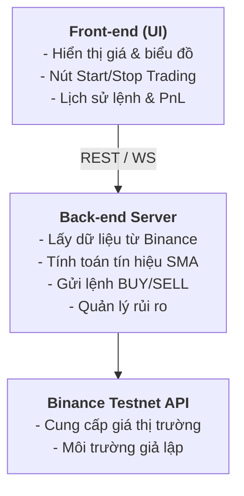

# **Đề tài: Xây dựng Bot Giao dịch Tiền điện tử trên Binance Testnet**

## **1. Mục tiêu của Đề tài**

*   **Tìm hiểu công nghệ Blockchain** và ứng dụng của nó trong giao dịch tiền điện tử.
*   **Tìm hiểu và sử dụng Binance API (Testnet)** để lấy dữ liệu thị trường và thực hiện lệnh giao dịch tự động.
*   **Xây dựng ứng dụng Web** hoàn chỉnh bao gồm:
    *   **Front-end:** Giao diện điều khiển bot trading, trực quan hóa dữ liệu.
    *   **Back-end:** Kết nối với Binance Testnet, xử lý thuật toán trading và quản lý rủi ro.
*   **Thiết kế thuật toán trading** tự động đơn giản (ví dụ: SMA Crossover Strategy).
*   **Triển khai và demo** hệ thống thực tế, kiểm thử trên môi trường Binance Testnet.

## **2. Phạm vi và Công nghệ sử dụng**

| Thành phần | Công nghệ | Mục đích |
| :--- | :--- | :--- |
| **Blockchain** | Binance Smart Chain (tham khảo) | Hiểu cơ chế lưu trữ & xác thực giao dịch |
| **API Trading** | Binance Spot Testnet API | Lấy dữ liệu & đặt lệnh mua/bán |
| **Back-end** | Node.js + Express + TypeScript | Giao tiếp với Binance API, xử lý logic |
| **Front-end** | React (Vite) / HTML / Chart.js | Hiển thị giá và điều khiển bot |
| **Giao tiếp** | REST API / WebSocket | Kết nối realtime giữa server và client |
| **Quản lý code** | GitHub Projects + Issues | Theo dõi tiến độ nhóm |
| **Triển khai (tùy chọn)** | Railway / Render / Docker | Deploy ứng dụng demo |

## **3. Kiến trúc hệ thống**



## **4. Thuật toán Trading (Ví dụ: SMA Crossover)**

#### **Ý tưởng:**

Dựa trên việc tính toán và so sánh hai đường trung bình động đơn giản (SMA) với các khung thời gian khác nhau:
*   **SMA nhanh (fast):** Ví dụ, trung bình giá của 7 cây nến gần nhất.
*   **SMA chậm (slow):** Ví dụ, trung bình giá của 25 cây nến gần nhất.

#### **Quy tắc giao dịch:**
*   **Tín hiệu MUA (BUY):** Khi đường SMA nhanh cắt lên trên đường SMA chậm.
*   **Tín hiệu BÁN (SELL):** Khi đường SMA nhanh cắt xuống dưới đường SMA chậm.

#### **Quản lý rủi ro:**
*   **Giới hạn lỗ hàng ngày:** Ngừng giao dịch nếu tổng lỗ trong ngày vượt quá một ngưỡng nhất định (`MAX_DAILY_LOSS`).
*   **Giới hạn khối lượng giao dịch:** Kiểm soát khối lượng tối đa cho mỗi lệnh (`MAX_OPEN_NOTIONAL`).

## **5. Kết quả mong đợi**

✅ **Ứng dụng web** có khả năng lấy và hiển thị giá realtime từ Binance Testnet.

✅ **Thực hiện lệnh BUY/SELL** tự động dựa trên tín hiệu từ thuật toán SMA Crossover.

✅ **Ghi log giao dịch**, hiển thị biểu đồ trực quan và trạng thái hoạt động của bot.

✅ **Hoàn thiện tài liệu** hướng dẫn sử dụng, báo cáo học thuật và video demo sản phẩm.

---

## **6. Cấu trúc Project**

```
SE2025-9.4/
├── design/                      # 🎨 Thiết kế UI/UX
│   ├── figma-files/            # File .fig export từ Figma
│   ├── assets/                 # Icons, images, components
│   ├── screenshots/            # Screenshots các screens
│   ├── README.md               # Design guidelines
│   ├── QUICK_START.md          # Hướng dẫn nhanh cho designer
│   ├── wireframes.md           # Wireframe specifications
│   ├── design-tokens.json      # Design system tokens
│   └── CHANGELOG.md            # Lịch sử thay đổi design
│
├── frontend/                   # ⚛️ React + Vite + TypeScript
│   ├── src/
│   ├── public/
│   └── package.json
│
├── backend/                    # 🚀 Node.js + Express + TypeScript
│   ├── src/
│   └── package.json
│
├── data_download/              # 📊 Historical data
│   └── *.csv
│
└── docs/                       # 📚 Documentation
```

---

## **7. Design Workflow với Figma**

### 🎨 Quy trình thiết kế

1. **Thiết kế trên Figma**
   - Tạo/chỉnh sửa design theo [Design Guidelines](./design/README.md)
   - Follow [Wireframes](./design/wireframes.md) specifications
   - Use Design System từ [design-tokens.json](./design/design-tokens.json)

2. **Export từ Figma**
   ```
   File → Save as .fig → Lưu vào design/figma-files/
   Export screens → PNG (2x) → Lưu vào design/screenshots/
   Export assets → SVG/PNG → Lưu vào design/assets/
   ```

3. **Commit lên GitHub**
   ```bash
   git add design/
   git commit -m "design: update dashboard layout v1.2"
   git push origin main
   ```

4. **Review & Iterate**
   - Team review trên Figma comments
   - Update theo feedback
   - Re-export và commit

### 📋 Quy tắc đặt tên

- **File Figma:** `CryptoBot-Design-YYYY-MM-DD.fig`
- **Screenshots:** `[ScreenName]-v[Version]-YYYY-MM-DD.png`
- **Assets:** `[category]-[name]-[size].svg`

### 🔗 Resources

- **Design Guidelines:** [design/README.md](./design/README.md)
- **Quick Start Guide:** [design/QUICK_START.md](./design/QUICK_START.md)
- **Wireframes:** [design/wireframes.md](./design/wireframes.md)
- **Design System:** [design/design-tokens.json](./design/design-tokens.json)

---

## **8. Getting Started**

### Prerequisites
- Node.js >= 18.x
- npm hoặc yarn
- Binance Testnet Account
- Figma Account (cho designers)

### Setup

#### 1. Clone Repository
```bash
git clone https://github.com/dangdoday/SE2025-9.4.git
cd SE2025-9.4
```

#### 2. Setup Frontend
```bash
cd frontend
npm install
npm run dev
```

#### 3. Setup Backend
```bash
cd backend
npm install
npm run dev
```

#### 4. Design (Dành cho Designers)
1. Đọc [Design Quick Start](./design/QUICK_START.md)
2. Tạo Figma project
3. Follow [Design Guidelines](./design/README.md)
4. Export và push lên GitHub theo workflow

---

## **9. Team Workflow**

### Designers
1. Design screens theo wireframes
2. Export files từ Figma
3. Commit vào `design/` folder
4. Update CHANGELOG.md
5. Notify developers

### Frontend Developers
1. Review design trong `design/screenshots/`
2. Check design specs trong `design/wireframes.md`
3. Implement UI với React
4. Use design tokens từ `design-tokens.json`
5. Request clarification nếu cần

### Backend Developers
1. Review API requirements
2. Implement Binance integration
3. Create REST/WebSocket endpoints
4. Test với Testnet

---

## **10. Contributing**

1. Create branch từ `main`
   ```bash
   git checkout -b feature/your-feature-name
   ```

2. Make changes và commit
   ```bash
   git add .
   git commit -m "type: description"
   ```
   
   **Commit types:**
   - `feat`: New feature
   - `fix`: Bug fix
   - `design`: Design changes
   - `docs`: Documentation
   - `refactor`: Code refactoring

3. Push và create Pull Request
   ```bash
   git push origin feature/your-feature-name
   ```

---

## **11. Resources & References**

- [Binance Testnet](https://testnet.binance.vision/)
- [Binance API Documentation](https://binance-docs.github.io/apidocs/spot/en/)
- [TradingView Charting Library](https://www.tradingview.com/charting-library-docs/)
- [React Documentation](https://react.dev/)
- [Figma Best Practices](https://www.figma.com/best-practices/)

````
