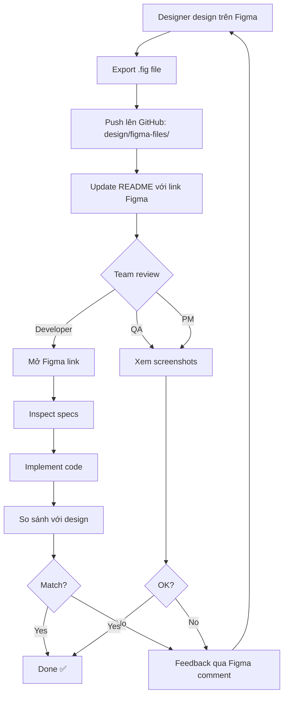

# 🎨 Cách Xem và Kiểm Tra Design Figma

## 📌 TL;DR (Quá dài không đọc)

**Cách nhanh nhất:** Mở link Figma trong file `design/figma-files/README.md`

---

## 🎯 3 Cách Xem Design

### 🌟 Cách 1: Xem trên Figma Web (KHUYẾN NGHỊ)

#### Bước 1: Lấy link Figma
```
1. Mở file: design/figma-files/README.md
2. Tìm bảng "Lịch sử Export"
3. Click vào cột "Link Figma" của version mới nhất
```

#### Bước 2: Xem design
```
1. Browser sẽ mở Figma với design đầy đủ
2. KHÔNG cần đăng nhập để XEM (chỉ cần để comment)
3. Click vào từng màn hình để xem chi tiết
```

#### Bước 3: Xem specifications (cho developers)
```
1. Click chọn 1 element (button, text, card...)
2. Panel bên phải sẽ hiện:
   - Width, Height (kích thước)
   - Fill (màu nền)
   - Stroke (viền)
   - Font, Size, Weight (chữ)
   - Border radius (bo góc)
   - Padding, Margin (khoảng cách)
3. Click "Code" tab → Copy CSS/SwiftUI/XML code
```

#### ✅ Ưu điểm:
- Xem realtime, không cần tải file
- Xem được specifications chính xác
- Comment trực tiếp lên design
- Xem được prototype animations
- Luôn là version mới nhất

#### ❌ Nhược điểm:
- Cần internet

---

### 📥 Cách 2: Import file .fig vào Figma Desktop

#### Bước 1: Tải file .fig
```
1. Vào folder: design/figma-files/
2. Tải file: CryptoBot-Design-YYYY-MM-DD.fig
   (Chọn file có ngày mới nhất)
```

#### Bước 2: Import vào Figma
```
1. Mở Figma Desktop app HOẶC figma.com
2. Click "Import file" ở màn hình chính
3. Chọn file .fig vừa tải
4. File sẽ được import vào workspace của bạn
```

#### Bước 3: Mở và xem
```
1. Double-click vào project vừa import
2. Xem như cách 1
```

#### ✅ Ưu điểm:
- Có thể chỉnh sửa design locally
- Không cần internet sau khi import
- Có thể fork và thử nghiệm

#### ❌ Nhược điểm:
- Phải tải file mỗi khi có update
- Có thể xem version cũ nếu không update

---

### 🖼️ Cách 3: Xem Screenshots

#### Bước 1: Mở folder screenshots
```
1. Vào folder: design/screenshots/
2. Sẽ thấy các file PNG:
   - dashboard-desktop.png
   - dashboard-mobile.png
   - trade-history.png
   - settings.png
   ...
```

#### Bước 2: Mở bằng image viewer
```
- Windows: Double-click → Photos app
- Mac: Double-click → Preview
- Linux: Mở bằng Image Viewer
```

#### ✅ Ưu điểm:
- Cực kỳ nhanh, không cần tool đặc biệt
- Có thể xem offline
- Dễ share qua chat

#### ❌ Nhược điểm:
- Không xem được specifications
- Không zoom vào chi tiết được
- Chỉ là ảnh tĩnh, không có prototype

---

## 🔍 Cách Inspect Design (Cho Developers)

### Trên Figma (Cách 1 hoặc 2)

#### Inspect Colors
```
1. Click vào element có màu
2. Bên phải panel → Section "Fill"
3. Sẽ thấy: #F0B90B hoặc RGB(240, 185, 11)
4. Click vào color → Copy Hex/RGB/HSL
```

#### Inspect Typography
```
1. Click vào text element
2. Bên phải panel → Section "Type settings"
3. Sẽ thấy:
   - Font: Inter
   - Weight: Bold
   - Size: 24px
   - Line height: 32px
   - Letter spacing: 0
```

#### Inspect Spacing
```
1. Click vào element
2. Hover vào element khác gần nó
3. Sẽ hiện số đo khoảng cách (màu đỏ)
4. Hoặc check panel phải → Padding, Margin
```

#### Inspect Layout
```
1. Click vào frame/container
2. Panel phải → Section "Layout"
3. Sẽ thấy:
   - Width, Height
   - Auto-layout direction (Horizontal/Vertical)
   - Gap between items
   - Padding
   - Alignment
```

#### Copy CSS Code
```
1. Click vào element
2. Panel phải → Tab "Code" (</> icon)
3. Chọn platform:
   - CSS
   - iOS (Swift)
   - Android (XML)
4. Click "Copy" → Paste vào code
```

**Ví dụ:**
```css
/* Figma sẽ generate: */
.button-primary {
  width: 120px;
  height: 40px;
  background: #0ECB81;
  border-radius: 8px;
  font-family: 'Inter';
  font-weight: 600;
  font-size: 16px;
  color: #FFFFFF;
}
```

---

## 💬 Cách Comment và Feedback

### Comment trực tiếp trên Figma

#### Bước 1: Vào mode comment
```
- Press phím C
- Hoặc click icon 💬 ở toolbar trên
```

#### Bước 2: Click vào chỗ muốn comment
```
- Click vào element cần feedback
- Một marker sẽ xuất hiện
```

#### Bước 3: Viết comment
```
- Viết feedback cụ thể
- Tag người cần xem: @designer_name
- Có thể attach ảnh
```

#### Bước 4: Resolve sau khi fix
```
- Designer sẽ fix
- Click "Resolve" khi done
```

**Ví dụ comment tốt:**
```
❌ BAD: "Button này không đẹp"
✅ GOOD: "Button này quá nhỏ (32px height), 
         nên tăng lên 40px để dễ click hơn trên mobile.
         Tham khảo Material Design guideline: 
         minimum touch target 48x48dp"
```

### Tạo GitHub Issue (Cho feedback lớn)

```markdown
Title: [Design] Dashboard - Cải thiện UX cho control panel

## Issue
Control panel hiện tại khó sử dụng trên mobile vì:
1. Buttons quá nhỏ (32px)
2. Spacing giữa các elements không đủ
3. Text quá nhỏ (12px)

## Screenshots
[Attach ảnh từ Figma hoặc design/screenshots/]

## Suggestions
1. Tăng button height lên 44px (iOS standard)
2. Tăng spacing giữa buttons từ 8px → 16px
3. Tăng font size từ 12px → 14px

## Priority
High - Ảnh hưởng đến usability trên mobile

## Related Files
- design/figma-files/CryptoBot-Design-2025-10-28.fig
- design/screenshots/dashboard-mobile.png
```

---

## 📊 So Sánh Code với Design

### Tool 1: Overlay Design trên Browser (Manual)
```
1. Mở Figma → Export screen as PNG (2x)
2. Mở app trong browser
3. Dùng extension "Perfect Pixel" hoặc tương tự
4. Overlay design PNG lên app
5. Adjust opacity → So sánh pixel-by-pixel
```

### Tool 2: Figma Inspector Extension
```
1. Install Figma Inspector (Chrome/Firefox extension)
2. Mở Figma design
3. Mở app trong browser
4. Extension sẽ so sánh CSS properties
```

### Tool 3: Manual Check (Simple)
```
Checklist:
[ ] Colors match? (Use ColorZilla to pick color)
[ ] Font sizes match?
[ ] Spacing match? (Use browser dev tools to measure)
[ ] Border radius match?
[ ] Shadows match?
```

---

## 🛠️ Tools & Extensions

### Figma Plugins (Trong Figma)
1. **Stark** - Check accessibility (contrast, colorblind)
2. **Contrast** - Check WCAG color contrast
3. **Measure** - Show measurements between elements
4. **Redlines** - Add measurement annotations

### Browser Extensions
1. **Perfect Pixel** - Overlay design on webpage
2. **ColorZilla** - Pick colors from design/webpage
3. **WhatFont** - Identify fonts
4. **Figma Mirror** - Preview design on phone

### Desktop Apps
1. **Figma Desktop** - Better performance than web
2. **Abstract** - Version control for design (enterprise)

---

## 🆘 Troubleshooting

### ❓ "Link Figma không mở được (404)"

**Nguyên nhân:** Link chưa được share hoặc permission sai

**Giải pháp:**
1. Hỏi designer share lại link
2. Yêu cầu permission: "Anyone with link can view"
3. Hoặc yêu cầu designer invite bạn vào project

---

### ❓ "File .fig không mở được bằng app khác"

**Nguyên nhân:** File .fig chỉ mở được trong Figma

**Giải pháp:**
1. KHÔNG thể mở bằng Photoshop, Illustrator, etc.
2. Phải import vào Figma (web hoặc desktop app)
3. Figma → File → Import → Chọn .fig

---

### ❓ "Màu sắc trong code khác màu trong design"

**Nguyên nhân:** 
- Dùng màu sai
- Color profile khác nhau
- Display không chuẩn

**Giải pháp:**
1. Check design tokens: `design/design-tokens.json`
2. Copy màu chính xác từ Figma (panel phải)
3. Dùng ColorZilla pick màu từ Figma để verify
4. Đảm bảo browser không có filter (Night mode, etc.)

---

### ❓ "Font không hiển thị đúng"

**Nguyên nhân:** Font chưa cài trên máy

**Giải pháp:**
1. Check font trong design: Thường là "Inter" hoặc "Roboto"
2. Download font từ Google Fonts
3. Hoặc dùng system font fallback:
```css
font-family: 'Inter', -apple-system, BlinkMacSystemFont, 
             'Segoe UI', sans-serif;
```

---

### ❓ "Design mới nhưng link vẫn hiện design cũ"

**Nguyên nhân:** Cache browser hoặc xem sai link

**Giải pháp:**
1. Hard refresh: Ctrl + F5 (Windows) hoặc Cmd + Shift + R (Mac)
2. Check bảng "Lịch sử Export" → Đảm bảo click link mới nhất
3. Clear browser cache
4. Mở incognito/private window

---

### ❓ "Không thấy specifications panel"

**Nguyên nhân:** Chưa chọn element hoặc bị ẩn panel

**Giải pháp:**
1. Click vào 1 element trong Figma
2. Panel phải sẽ hiện
3. Nếu vẫn không thấy → Click icon "Design" ở toolbar phải
4. Hoặc phím tắt: Alt + 8

---

## 📝 Workflow Tổng Quan



---

## 🎓 Best Practices

### Cho Developers
1. ✅ Luôn xem design trước khi code
2. ✅ Sử dụng design tokens, không hardcode
3. ✅ Inspect specs chính xác từ Figma
4. ✅ Check responsive trên nhiều breakpoints
5. ✅ So sánh với design sau khi implement
6. ✅ Comment trên Figma nếu có vấn đề

### Cho Reviewers
1. ✅ Review trên Figma (tốt nhất) hoặc screenshots
2. ✅ Check theo REVIEW_CHECKLIST.md
3. ✅ Comment cụ thể, có gợi ý
4. ✅ Tag designer khi cần clarify
5. ✅ Resolve comment sau khi fix

### Cho Designers
1. ✅ Share link Figma với permission đúng
2. ✅ Export .fig file định kỳ
3. ✅ Export screenshots rõ ràng
4. ✅ Document specifications kỹ
5. ✅ Respond comment nhanh chóng

---

## 📚 Tài Liệu Liên Quan

- 📋 [Review Checklist](./REVIEW_CHECKLIST.md) - Checklist đầy đủ để review design
- 🚀 [Quick Start](./QUICK_START.md) - Hướng dẫn setup và bắt đầu nhanh
- 📐 [Wireframes](./wireframes.md) - Wireframe và specs của từng màn hình
- 🎨 [Design Tokens](./design-tokens.json) - Colors, typography, spacing
- 📝 [README](./README.md) - Tổng quan về design system
- 📅 [Changelog](./CHANGELOG.md) - Lịch sử thay đổi design

---

## 💡 Tips

### Shortcut keys trong Figma
- `C` - Comment mode
- `V` - Move tool
- `K` - Scale tool
- `R` - Rectangle
- `T` - Text
- `Ctrl/Cmd + /` - Search commands
- `Ctrl/Cmd + D` - Duplicate
- `Alt + Click` - Measure distance

### Học Figma nhanh
- [Figma Crash Course (30 min)](https://www.youtube.com/watch?v=Cx2dkpBxst8)
- [Figma for Developers](https://www.figma.com/resources/learn-design/developers/)
- Practice: Recreate một UI có sẵn

---

**Questions? Create a GitHub Issue với label `design` hoặc hỏi trong team chat! 💬**
