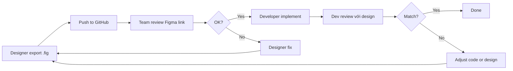

# 📋 Design Review Checklist

## Cách Kiểm Tra Design Figma

### 1. Truy cập Figma Design

#### Option A: Xem trên Figma (Khuyến nghị)
```
1. Mở link Figma được cung cấp trong bảng lịch sử export
2. Click vào file để xem design
3. Có thể comment trực tiếp trên Figma
```

**Ưu điểm:**
- Xem realtime, không cần tải file
- Comment trực tiếp vào design
- Xem được các prototype và animation
- Xem được specifications (kích thước, màu sắc, font)

#### Option B: Import file .fig vào Figma
```
1. Tải file .fig từ thư mục design/figma-files/
2. Vào Figma → Import file → Chọn file .fig
3. File sẽ được mở trong Figma của bạn
```

#### Option C: Xem Screenshots (Nhanh)
```
1. Vào thư mục design/screenshots/
2. Xem các ảnh preview của từng màn hình
```

---

## 2. Checklist Review Design

### ✅ Giao diện Tổng quát

- [ ] **Branding & Identity**
  - [ ] Logo rõ ràng, đúng kích thước
  - [ ] Color scheme nhất quán
  - [ ] Typography đồng nhất

- [ ] **Layout**
  - [ ] Responsive trên các breakpoint (Desktop, Tablet, Mobile)
  - [ ] Spacing nhất quán (margin, padding)
  - [ ] Alignment chính xác
  - [ ] Grid system được áp dụng đúng

- [ ] **Navigation**
  - [ ] Menu/Navigation bar rõ ràng
  - [ ] User flow logic, dễ hiểu
  - [ ] Breadcrumb (nếu có) hoạt động đúng

---

### ✅ Các Màn hình Chính (Crypto Trading Bot)

#### Dashboard / Trang chủ
- [ ] Hiển thị giá BTC/USDT realtime
- [ ] Chart giá rõ ràng, dễ đọc
- [ ] Nút Start/Stop Trading dễ thấy
- [ ] Hiển thị trạng thái bot (Running/Stopped)
- [ ] Hiển thị số dư tài khoản
- [ ] Hiển thị PnL (Profit & Loss) hiện tại

#### Biểu đồ & Indicators
- [ ] Chart hiển thị đường SMA Fast và SMA Slow
- [ ] Có chú thích (legend) cho các đường SMA
- [ ] Timeframe selector (1h, 4h, 12h, 1d)
- [ ] Zoom in/out và pan chart
- [ ] Tooltip hiển thị giá khi hover

#### Lịch sử Giao dịch (Trade History)
- [ ] Bảng hiển thị các lệnh BUY/SELL
- [ ] Cột: Time, Side (Buy/Sell), Price, Quantity, Total, Status
- [ ] Phân trang hoặc infinite scroll
- [ ] Filter theo thời gian, loại lệnh
- [ ] Export CSV (optional)

#### Cấu hình Bot (Settings)
- [ ] Input cho SMA Fast period
- [ ] Input cho SMA Slow period
- [ ] Input cho Max Daily Loss
- [ ] Input cho Max Open Notional
- [ ] Nút Save Settings
- [ ] Validation và error messages

#### Quản lý Rủi ro (Risk Management)
- [ ] Hiển thị Daily Loss hiện tại
- [ ] Progress bar cho Daily Loss limit
- [ ] Warning khi gần đạt limit
- [ ] Stop Loss settings (nếu có)

---

### ✅ UI Components

#### Buttons
- [ ] Primary, Secondary, Danger states rõ ràng
- [ ] Hover, Active, Disabled states
- [ ] Loading state (spinner)
- [ ] Icon + text alignment đúng

#### Forms & Inputs
- [ ] Label rõ ràng cho mỗi field
- [ ] Placeholder text hợp lý
- [ ] Validation messages (error, success)
- [ ] Focus state dễ nhận biết
- [ ] Required fields được đánh dấu

#### Cards & Containers
- [ ] Border radius nhất quán
- [ ] Shadow/elevation phù hợp
- [ ] Padding/spacing đồng nhất
- [ ] Background color hợp lý

#### Tables
- [ ] Header rõ ràng
- [ ] Zebra striping (nếu có)
- [ ] Hover state cho rows
- [ ] Sortable columns (nếu có)
- [ ] Responsive trên mobile

#### Charts
- [ ] Axes labels rõ ràng
- [ ] Color scheme dễ phân biệt
- [ ] Legend/chú thích đầy đủ
- [ ] Responsive, scale đúng

---

### ✅ Colors & Typography

#### Colors
- [ ] Sử dụng đúng design tokens (xem `design-tokens.json`)
- [ ] Contrast ratio đủ (WCAG AA minimum)
- [ ] Green cho Buy, Red cho Sell
- [ ] Warning/Error colors phù hợp

#### Typography
- [ ] Font sizes theo hierarchy (H1, H2, Body, Caption)
- [ ] Line height đủ để đọc
- [ ] Font weight phù hợp (Regular, Medium, Bold)
- [ ] Không dùng quá nhiều font styles

---

### ✅ Icons & Images

- [ ] Icons có kích thước nhất quán
- [ ] Icons có ý nghĩa rõ ràng (hoặc có tooltip)
- [ ] SVG icons (vector) thay vì PNG/JPG
- [ ] Images có alt text (accessibility)

---

### ✅ Interactions & States

#### Loading States
- [ ] Skeleton screens hoặc spinners
- [ ] Không để màn hình trắng khi loading
- [ ] Loading text rõ ràng

#### Empty States
- [ ] Hiển thị message khi không có data
- [ ] Icon/illustration phù hợp
- [ ] Call-to-action (nếu cần)

#### Error States
- [ ] Error messages rõ ràng, helpful
- [ ] Retry button (nếu cần)
- [ ] Không crash UI

---

### ✅ Accessibility (A11y)

- [ ] Keyboard navigation hoạt động
- [ ] Focus states rõ ràng
- [ ] Color contrast đủ (WCAG AA)
- [ ] Aria labels cho screen readers
- [ ] Text có thể phóng to 200% mà không bị lỗi

---

### ✅ Responsive Design

- [ ] **Desktop (≥1280px):** Full layout
- [ ] **Tablet (768px - 1279px):** Adapted layout
- [ ] **Mobile (≤767px):** Mobile-optimized
- [ ] Không có horizontal scroll
- [ ] Touch targets ≥44px x 44px trên mobile

---

### ✅ Performance Considerations

- [ ] Không sử dụng quá nhiều custom fonts
- [ ] Images được optimize (WebP, lazy loading)
- [ ] Animations không quá nặng (60fps)
- [ ] Chart không render quá nhiều data points

---

## 3. Cách Comment và Feedback

### Trên Figma (Khuyến nghị)
```
1. Click vào phần tử cần comment
2. Press C (hoặc click icon Comment)
3. Viết feedback cụ thể
4. Tag @designer nếu cần
5. Resolve comment sau khi fix
```

### Qua GitHub Issues
```
1. Tạo Issue mới với label "design"
2. Title: [Design Review] Tên màn hình
3. Attach screenshots từ Figma
4. Mô tả vấn đề và gợi ý cải thiện
```

### Qua Chat/Meeting
```
- Chuẩn bị checklist trước
- Share screen và walk-through từng màn hình
- Ghi chú lại feedback
- Update vào Figma comments sau meeting
```

---

## 4. Workflow Review Design



---

## 5. Tools Hỗ trợ

### Figma Plugins hữu ích
- **Contrast Checker:** Kiểm tra color contrast
- **Stark:** Accessibility checker
- **Lorem Ipsum Generator:** Generate dummy text
- **Unsplash:** Insert stock photos
- **Iconify:** Insert icons

### Browser Extensions
- **Figma Mirror:** Preview design trên mobile device
- **ColorZilla:** Pick colors từ design
- **Pesticide:** Show layout boundaries

---

## 6. Tài liệu Tham khảo

- [Figma Best Practices](https://www.figma.com/best-practices/)
- [Material Design Guidelines](https://material.io/design)
- [WCAG Accessibility Guidelines](https://www.w3.org/WAI/WCAG21/quickref/)
- Design Tokens: Xem file `design-tokens.json`
- Wireframes: Xem file `wireframes.md`

---

## ⚠️ Common Issues

| Issue | Solution |
|-------|----------|
| Không mở được file .fig | Import vào Figma, không mở trực tiếp |
| Link Figma bị 404 | Kiểm tra permission, yêu cầu designer share |
| Design khác với code | Sync design tokens, check latest version |
| Màu sắc không khớp | Export design tokens từ Figma |
| Font không có | Yêu cầu designer dùng Google Fonts hoặc system fonts |

---

## 📝 Template Feedback

```markdown
## [Màn hình: Dashboard]

### ✅ Good
- Chart rõ ràng, dễ đọc
- Color scheme hợp lý

### 🔧 Cần cải thiện
- Nút Start/Stop quá nhỏ, khó click trên mobile
- Spacing giữa cards không đồng nhất (16px vs 24px)
- Font size của label quá nhỏ (10px → nên 12px)

### 💡 Suggestions
- Thêm dark mode
- Thêm tooltip cho các icon
- Cân nhắc thêm sound/notification khi có signal
```

---

**Happy Reviewing! 🎨✨**
